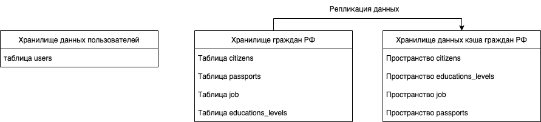
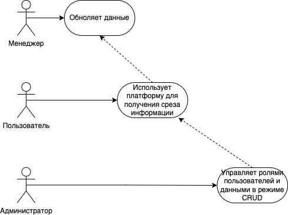
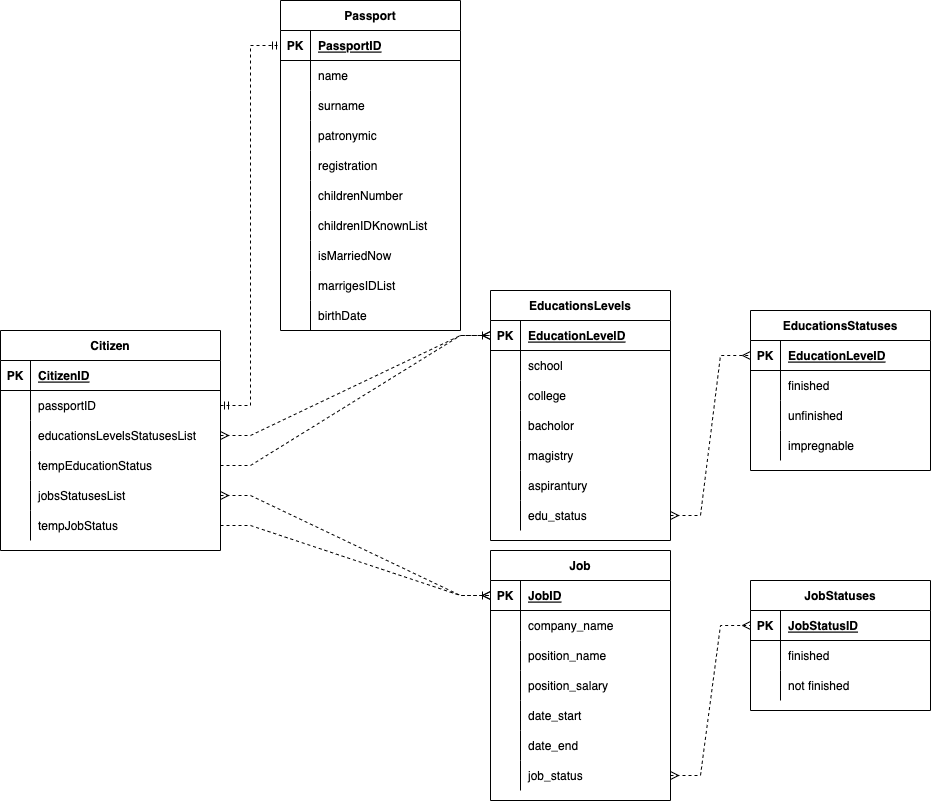
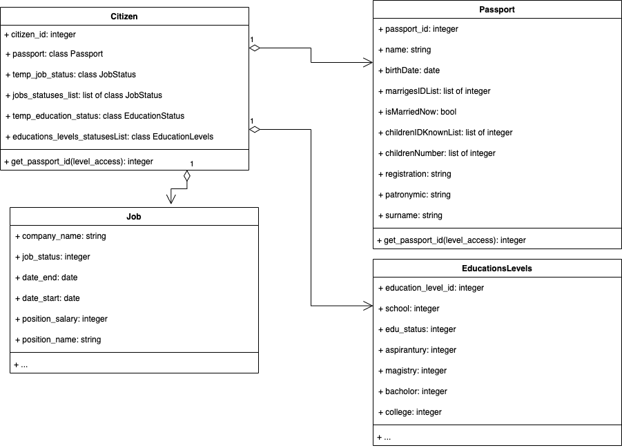
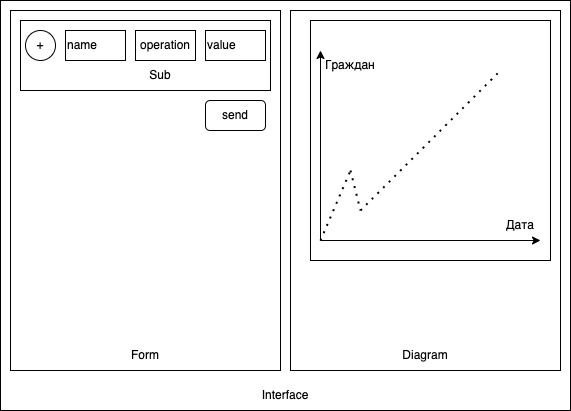
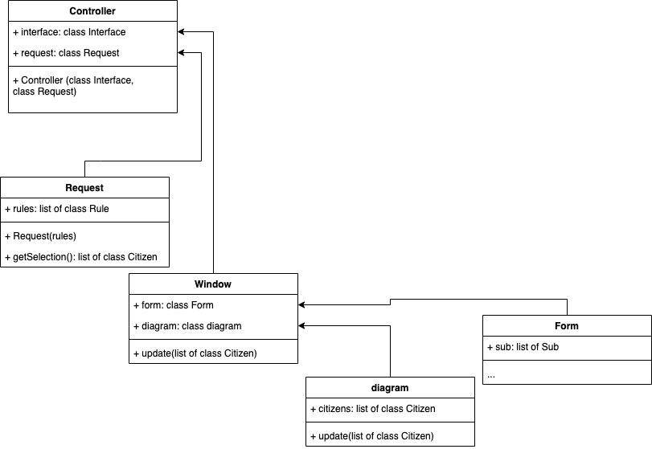

# ES - Election statistics

## Цель работы

Процесс проведения предвыборной-агитационной кампании в Российской Федерации является критически важным для любой политической единицы и структуры: от ее результата зависит дальнейшее положение во власти и место в системе.

Каждое специализированное программное решение было разработано и продолжает модифицироваться специально для конкретной политической единицы. Причем доступ предоставляется только для членов той или иной политической организации.

Интерфейс программных решений позволяет при наличие соответствующего уровня доступа получить нужную выгрузку данных о том или ином мандате.

Все существующие решения не имеют категоризации данных в динамическом режиме, а позволяют совершать операции выгрузки по заранее продуманным шаблонам, что не позволяет получить ответ на конкретный вопрос о том или ином срезе мандата в определенных промежуток времени.

А именно срез данных для проведения кампаний является ключевым для получения мест в органах законодательной и исполнительной власти путем элективных процессов.

Цель данной работы – программное обеспечение (далее ES - Election Statistics) для хранения и категоризации данных электората императивного мандата.

## Решаемая проблема/предоставляемая возможность

Каждый мандат имеет свои специфические особенности, которые приходится учитывать избирающимся кандидатам: климат, рельеф, этнос, культура и национальные принадлежности. Не всегда кандидат на выборный пост является жителем региона, в котором выбирается, зачастую, это связано с ротацией кадров по уровню квалификации профессиональных навыков. Именно ротация позволяет выровнять баланс между руководящими составами и их командами в субъектах Российской Федерации  от муниципальных образований до федеральных субъектов. 

Зачастую сформированные годами на территории мандата правила предвыборных кампаний оказываются провальными, хотя выработанные техники укладываются в специфические особенности субъекта. Это связано с тем, что агрегация данных не происходит с достаточным уровнем динамического плюрализма по направлением. Только явно категоризированные данные могут однозначно показать результат транспарентности в избирательной кампании.

Изменение особенностей электората манадата может быть связано как с его перемещением (динамический/перемещающийся мандат), но в большей части с реакцией текущего руководящего состава на происходящие социально-экономические микро и макро конфликты в обществе. 

А именно такие данные можно категоризировать различными технологиями и методами, к тому же только эти данные можно получать в автоматическом или полуавтоматическом режиме, взаимодействуя посредством открытого/полуоткрытого АПИ с федеральными органами власти, крупнейшими рекрутинговыми компаниями и интегрированными некоммерческими организациями в систему.

Самой малой единицей политического процесса нашей страны является гражданин Российской  Федерации, поэтому именно его надо брать в качестве минимальной единицы представления данных, именно данные, связанные с ним, нужно агрегировать о удобным для политический технологов представлять.

Для решения социально-экономических микро и макро конфликтов необходимо представлять гражданина со всей информацией, не запрещенной к хранению и дальнейшему использованию, содержащейся в его паспорте, полных данных о месте его работы и уровне образования. В дальнейшем такую модель можно автоматически расширять путем дополнения данными об интересах пользователя и его увлечениях с помощью АПИ социальных сетей.

Кроме того, имея динамически изменяющийся срез данных об электорате текущее руководство субъекта, пришедшее выборным путем, может выбирать подходящее время настроений для тех или иных серьезных решений.

## Краткий перечень функциональных требований

## Архитектура и верхнеуровневая логика

Спроектированная архитектура учитывает разделенные базы пользователей и данных системы, а также репликацию данныж граждан.

Схема сущностей WEB-приложения ES:

Пользователь приложения делится на три уровня доступа, каждый из которых разрешает более высокому уровню выполнять свой набор операций:

| Название       | Пользователь                | Менеджер | Администратор |
| ------------- |:------------------:| -----:| -----: |
| Просмотр среза данных (Дашборд)     | Да    | Да | Да |
| Обновление данных пользователей     | Нет |   Да | Да |
| CRUD всех данных  | Нет         |    Нет | Да |

Use-case диаграмма ES:

ER-диаграмма ES:

## Экраны приложения на уровне черновых эскизов

UML-базового модуля бизнес-логики:

Черновой эскиз экрана приложения:

UML примера реализации интерфейса:

